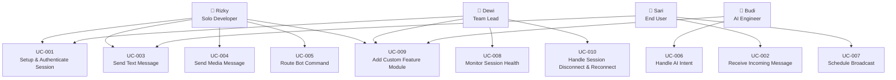

# DOC-003 · User Personas & Use Cases

> **Status:** Draft  
> **Version:** 1.0.0  
> **Last Updated:** 2026-08-03  
> **Owner:** System Analyst  

---

## 1. User Personas

### Persona 1: "Rizky" — The Solo Developer

| Attribute | Detail |
|-----------|--------|
| **Role** | Freelance Python Developer |
| **Usia** | 26 tahun |
| **Keahlian** | Python intermediate, basic Docker, pernah pakai library WA sebelumnya |
| **Goals** | Membangun bot WhatsApp untuk klien UMKM tanpa perlu mulai dari nol |
| **Frustrasi** | Library WA lain penuh bug, tidak ada struktur, dan semua contoh adalah `main.py` yang kaotis |
| **Quote** | *"Saya butuh starting point yang profesional, bukan sekedar 'hello world' bot."* |

---

### Persona 2: "Dewi" — The Team Lead

| Attribute | Detail |
|-----------|--------|
| **Role** | Tech Lead, tim kecil 3 developer |
| **Usia** | 31 tahun |
| **Keahlian** | Python senior, familiar dengan clean architecture, pernah pakai FastAPI di production |
| **Goals** | Membangun customer service bot untuk perusahaan, harus bisa dikerjakan tim |
| **Frustrasi** | Developer lain tidak bisa memahami codebase karena tidak ada standar; sulit onboarding |
| **Quote** | *"Saya butuh arsitektur yang bisa dijelaskan ke developer junior dalam 1 jam."* |

---

### Persona 3: "Budi" — The AI Enthusiast

| Attribute | Detail |
|-----------|--------|
| **Role** | AI Engineer, startup fintech |
| **Usia** | 29 tahun |
| **Keahlian** | Python senior, LangChain, OpenAI API, familiar dengan async programming |
| **Goals** | Mengintegrasikan LLM ke dalam WhatsApp sebagai channel AI assistant |
| **Frustrasi** | Harus membangun dari scratch setiap kali, integrasi WA selalu bottleneck |
| **Quote** | *"Saya tidak mau mikirin WA connection logic. Berikan saya interface yang bersih dan saya integrasi AI-nya."* |

---

### Persona 4: "Sari" — The Business Owner (End User)

| Attribute | Detail |
|-----------|--------|
| **Role** | Owner toko online, pelanggan bot yang dibangun developer |
| **Usia** | 38 tahun |
| **Keahlian** | Non-teknis, hanya pakai WhatsApp |
| **Goals** | Bot bisa menjawab pertanyaan produk, terima pesanan, kirim konfirmasi |
| **Frustrasi** | Bot sering offline, tidak bisa handle banyak pesan sekaligus, tidak ada monitoring |
| **Quote** | *"Kalau bot mati, saya rugi. Harus ada yang jaga."* |

---

## 2. Use Case Diagram

---

## 3. Use Case Specifications

---

### UC-001 · Setup & Authenticate Session

| Field | Value |
|-------|-------|
| **ID** | UC-001 |
| **Name** | Setup & Authenticate Session |
| **Actor Primary** | Developer (Rizky / Dewi) |
| **Trigger** | Developer menjalankan platform untuk pertama kali atau setelah logout |
| **Precondition** | Python environment aktif, nomor WA tersedia, internet aktif |
| **Postcondition** | Session status = `CONNECTED`, platform siap menerima pesan |

**Main Flow:**
1. Developer menjalankan `python -m whatsapp_platform`
2. Sistem mengecek apakah ada session yang tersimpan
3. Jika tidak ada: sistem generate QR code dan tampilkan di terminal
4. Developer scan QR dengan aplikasi WhatsApp di ponsel
5. Sistem menerima konfirmasi autentikasi dari WhatsApp server
6. Session disimpan ke storage (SQLite/DB)
7. Status berubah ke `CONNECTED`
8. Platform mulai listen untuk incoming events

**Alternative Flow:**
- **3a.** Session tersimpan ada: skip QR, langsung reconnect
- **4a.** QR timeout (> 60 detik): generate QR baru, ulangi

**Exception Flow:**
- **5a.** Autentikasi gagal: log error, exit dengan kode non-zero
- **7a.** DB tidak bisa diakses: log critical, exit gracefully

---

### UC-002 · Receive Incoming Message

| Field | Value |
|-------|-------|
| **ID** | UC-002 |
| **Name** | Receive Incoming Message |
| **Actor Primary** | End User (Sari), dimediasi oleh Neonize |
| **Trigger** | User mengirim pesan ke nomor WhatsApp yang terhubung ke platform |
| **Precondition** | Session status = `CONNECTED` |
| **Postcondition** | Pesan diproses oleh handler yang relevan |

**Main Flow:**
1. Neonize menerima `MessageEv` dari WhatsApp server
2. Gateway memetakan `MessageEv` ke `IncomingMessage` (value object)
3. Gateway mempublish `MessageReceived` (domain event)
4. EventBus mendistribusikan event ke semua subscribers
5. `CommandRouter` memeriksa apakah pesan adalah command
6. Jika command: delegasi ke `CommandHandler` yang sesuai
7. Jika bukan command: delegasi ke `DefaultMessageHandler`
8. Handler memproses dan mengirim respons (jika ada)

---

### UC-003 · Send Text Message

| Field | Value |
|-------|-------|
| **ID** | UC-003 |
| **Name** | Send Text Message |
| **Actor Primary** | Developer (via Handler code) atau End User (trigger respons) |
| **Trigger** | Handler memutuskan perlu mengirim respons teks |
| **Precondition** | Session = `CONNECTED`, `to_jid` valid |
| **Postcondition** | Pesan terkirim, status = `SENT` |

**Main Flow:**
1. Handler membuat `OutgoingMessage(to_jid=..., body="...")`
2. `SendMessageUseCase` menerima `OutgoingMessage`
3. UseCase memanggil `IMessagingGateway.send_text()`
4. Gateway menerjemahkan ke Neonize API call
5. Neonize mengirim pesan ke WhatsApp server
6. Status diupdate ke `SENT`
7. `MessageSent` domain event dipublish

---

### UC-004 · Send Media Message

| Field | Value |
|-------|-------|
| **ID** | UC-004 |
| **Name** | Send Media Message |
| **Actor Primary** | Developer (via Handler code) |
| **Trigger** | Handler memutuskan perlu mengirim media |
| **Precondition** | Session = `CONNECTED`, file media tersedia (path/URL/bytes) |
| **Postcondition** | Media terkirim |

**Main Flow:**
1. Handler membuat `OutgoingMessage` dengan `MediaContent`
2. `SendMessageUseCase` menerima request
3. UseCase memanggil `IMessagingGateway.send_media()`
4. Gateway mengupload media ke WhatsApp CDN
5. Gateway mengirim pesan dengan referensi media
6. Status diupdate ke `SENT`

---

### UC-005 · Route Bot Command

| Field | Value |
|-------|-------|
| **ID** | UC-005 |
| **Name** | Route Bot Command |
| **Actor Primary** | End User (Sari), Command Router |
| **Trigger** | `IncomingMessage.body` dimulai dengan prefix command (contoh: `!`) |
| **Precondition** | Session = `CONNECTED`, CommandRouter aktif |
| **Postcondition** | Command dieksekusi oleh handler yang tepat |

**Main Flow:**
1. `CommandRouter` menerima `IncomingMessage`
2. Parser mengekstrak `BotCommand(prefix, name, args)` dari body
3. Router mencari `CommandHandler` yang terdaftar untuk command ini
4. Handler ditemukan: eksekusi `handler.handle(ctx)`
5. Handler mengirim respons via `SendMessageUseCase`

**Alternative Flow:**
- **3a.** Tidak ada handler terdaftar: kirim pesan "Command tidak dikenal"
- **3b.** Command memerlukan permission tertentu: cek permission, tolak jika tidak ada

---

### UC-006 · Handle AI Intent

| Field | Value |
|-------|-------|
| **ID** | UC-006 |
| **Name** | Handle AI Intent |
| **Actor Primary** | End User (Sari), AI Integration Feature |
| **Trigger** | Pesan masuk yang tidak ada handler spesifik (default handler → AI) |
| **Precondition** | AI integration feature aktif, LLM API key tersedia |
| **Postcondition** | Respons AI terkirim ke user |

**Main Flow:**
1. `DefaultMessageHandler` mendelegasikan ke `AIIntegrationUseCase`
2. UseCase membangun prompt dari context conversation
3. UseCase memanggil `IAIProvider` interface
4. Provider memanggil LLM API (OpenAI / Gemini / local model)
5. Respons diterima dan dikirim ke user via `SendMessageUseCase`

---

### UC-007 · Schedule Broadcast

| Field | Value |
|-------|-------|
| **ID** | UC-007 |
| **Name** | Schedule Broadcast |
| **Actor Primary** | Developer (konfigurasi) atau End User (jika ada UI) |
| **Trigger** | Waktu terjadwal tercapai, atau command `!broadcast` dieksekusi |
| **Precondition** | Session = `CONNECTED`, daftar penerima tersedia |
| **Postcondition** | Pesan terkirim ke semua penerima |

---

### UC-008 · Monitor Session Health

| Field | Value |
|-------|-------|
| **ID** | UC-008 |
| **Name** | Monitor Session Health |
| **Actor Primary** | DevOps / Team Lead (Dewi) |
| **Trigger** | Continuous (background task setiap N detik) |
| **Precondition** | Platform berjalan |
| **Postcondition** | Health status tersedia via log / metrics endpoint |

---

### UC-009 · Add Custom Feature Module

| Field | Value |
|-------|-------|
| **ID** | UC-009 |
| **Name** | Add Custom Feature Module |
| **Actor Primary** | Developer (Rizky, Dewi, Budi) |
| **Trigger** | Developer membutuhkan fitur baru |
| **Precondition** | Platform berjalan secara lokal, developer memiliki akses kode |
| **Postcondition** | Feature baru aktif tanpa menyentuh kode fitur lain |

**Main Flow:**
1. Developer membuat folder `src/features/<feature_name>/`
2. Mengimplementasikan interface `IFeatureModule`
3. Mendaftarkan handlers ke `FeatureRegistry` (via config atau decorator)
4. Restart platform
5. Feature baru aktif dan handler berjalan

---

### UC-010 · Handle Session Disconnect & Reconnect

| Field | Value |
|-------|-------|
| **ID** | UC-010 |
| **Name** | Handle Session Disconnect & Reconnect |
| **Actor Primary** | System (otomatis) |
| **Trigger** | Koneksi ke WhatsApp server terputus |
| **Precondition** | Platform berjalan, internet tersedia |
| **Postcondition** | Session berhasil terhubung kembali tanpa re-scan QR |

**Main Flow:**
1. Neonize menerima `DisconnectedEv`
2. Gateway mempublish `SessionDisconnected` domain event
3. `SessionManager` menerima event, mulai countdown reconnect
4. Setelah delay (exponential backoff), coba reconnect dengan session tersimpan
5. Jika berhasil: `SessionConnected` event dipublish, status = `CONNECTED`
6. Jika gagal N kali: notifikasi alert, status = `FAILED`

---

## 4. User Stories Summary

| ID | User Story | Priority |
|----|-----------|----------|
| US-001 | Sebagai developer, saya ingin scan QR sekali dan session tersimpan otomatis | Must Have |
| US-002 | Sebagai developer, saya ingin menambah command handler baru tanpa edit kode inti | Must Have |
| US-003 | Sebagai developer, saya ingin bot auto-reconnect saat koneksi putus | Must Have |
| US-004 | Sebagai developer, saya ingin type hints di semua interface agar IDE membantu saya | Must Have |
| US-005 | Sebagai developer, saya ingin jalankan tests tanpa koneksi ke WhatsApp sungguhan | Must Have |
| US-006 | Sebagai end user, saya ingin bot menjawab dalam < 2 detik | Must Have |
| US-007 | Sebagai developer, saya ingin kirim gambar, dokumen, dan audio | Should Have |
| US-008 | Sebagai developer, saya ingin integrasi AI yang mudah | Should Have |
| US-009 | Sebagai team lead, saya ingin log terstruktur yang bisa di-search | Should Have |
| US-010 | Sebagai developer, saya ingin konfigurasi via env vars, bukan hardcode | Must Have |

---

## References

- [DOC-001: Product Vision](./01_product_vision.md)
- [DOC-002: Domain Glossary](./02_domain_glossary.md)
- [DOC-004: PRD](./04_prd.md)
- [DOC-011: SRS](./10_srs.md)
