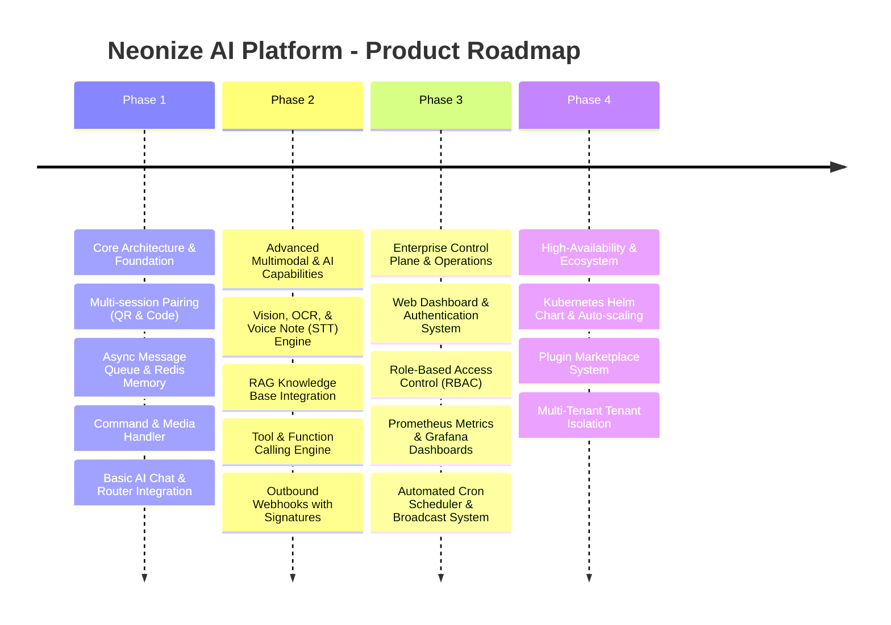

# 📄 Product Requirements Document (PRD)
# Neonize AI Platform — Multi-User Production-Grade Enterprise Messaging System

> **Document Status:** Approved for Design  
> **Version:** 1.0.0  
> **Target Environment:** Enterprise Production  
> **Last Updated:** 2026-08-03  
> **Owner:** Senior Product Manager & Software Architect  

---

## 1. Executive Summary

**Neonize AI Platform** adalah platform otomasi dan asisten kecerdasan buatan (*AI Assistant*) multi-user berkelas enterprise yang berjalan di atas protokol WhatsApp menggunakan **Neonize** (Go backend Whatsmeow + Python async runtime). 

Platform ini dirancang khusus untuk lingkungan **production**, memungkinkan pengelolaan banyak sesi WhatsApp secara bersamaan (*multi-session*), pengolahan pesan multimedia cerdas (Gambar, Audio, PDF, OCR, Vision), integrasi kecerdasan buatan tingkat tinggi (LLM Router, Conversational Memory, RAG, Tool/Function Calling), serta dilengkapi **Management Web Dashboard** berstandar keamanan tinggi (Authentication & RBAC).

---

## 2. Product Vision & Mission

### 2.1 Product Vision
> *"Menjadi infrastruktur komunikasi dan AI Messaging Platform terdepan yang paling scalable, aman, dan modular—menghubungkan ekosistem bisnis dengan berbagai AI agent cerdas melalui jaringan WhatsApp secara real-time."*

### 2.2 Product Mission
1. Menyediakan *multi-session WhatsApp gateway* yang ultra-fast, stabil, dan hemat resiko disonstruksi koneksi.
2. Mengintegrasikan kemampuan AI multimodal (Text, Vision, Speech-to-Text, Document Parsing, RAG) secara terisolasi dan modular.
3. Menyediakan ekosistem *plugin & tool calling* yang dinamis untuk otomasi alur kerja bisnis.
4. Menyajikan *enterprise control plane* (Dashboard, RBAC, Webhooks, Observability) siap pakai untuk skenario production.

---

## 3. Business Goals

1. **Enterprise Scalability**: Mampu menangani puluhan hingga ratusan sesi WhatsApp aktif secara bersamaan dalam satu kluster terdistribusi.
2. **Operational Efficiency**: Mengurangi waktu eskalasi customer support dan otomatisasi alur kerja bisnis hingga 70% melalui AI Assistant.
3. **High Availability (HA)**: Menjamin ketersediaan sistem >= 99.5% uptime dengan pemulihan sesi otomatis (*auto-reconnect*).
4. **Extensibility & Developer Experience**: Mempersingkat waktu integrasi fitur atau LLM baru dari mingguan menjadi harian melalui *Plugin System* standar.

---

## 4. User Personas

### Persona 1: Enterprise System Administrator (SysAdmin / DevOps)
- **Kebutuhan**: Mengelola deployment, memantau *health metrics*, mengkonfigurasi resource Docker, mengatur akses RBAC, dan memantau log sistem secara terpusat.
- **Frustrasi**: Kesulitan mengelola banyak bot WhatsApp yang terpisah-pisah dan tidak adanya observability standar.

### Persona 2: AI / Software Engineer (Integrator & Plugin Developer)
- **Kebutuhan**: Membuat plugin bisnis baru, mendaftarkan *custom function/tool calling*, menghubungkan RAG knowledge base, dan mengonfigurasi AI Routing.
- **Frustrasi**: Terlalu banyak membuang waktu mengurusi enkripsi/protokol WhatsApp daripada fokus pada logika kecerdasan AI.

### Persona 3: Customer Support / Operations Manager
- **Kebutuhan**: Memantau aktivitas sesi WhatsApp, mengontrol hak akses staf via Dashboard, serta memantau antrean pesan dan metrik performa AI.
- **Frustrasi**: Tidak adanya keterlihatan (*visibility*) terhadap percakapan bot dan tidak ada proteksi peran pengubah konfigurasi.

### Persona 4: End User (Pelanggan / Anggota Grup WhatsApp)
- **Kebutuhan**: Berinteraksi dengan WhatsApp bot yang responsif, cerdas, mampu memahami dokumen/suara/gambar, dan memberikan jawaban akurat.
- **Frustrasi**: Bot yang lambat, sering *off*, lupa konteks percakapan, atau gagal memahami media.

---

## 5. Scope & Out of Scope

### 5.1 In Scope (Platform Core)
- Authenticasi WhatsApp via **QR Code** dan **Pairing Code**.
- Pengelolaan **Multi-Session** WhatsApp yang terisolasi.
- **AI Engine**: AI Chat, Intelligent AI Router, Dynamic Memory Storage, RAG (Retrieval-Augmented Generation), Multimodal Vision, OCR, & Speech-to-Text Audio Processing.
- **Tool Calling & Function Calling**: Eksekusi aksi eksternal secara dinamis oleh LLM.
- **Handler & Plugin System**: Extensible Command, Media, dan Plugin Handler.
- **Asynchronous Architecture**: Task Queue (Redis/ARQ), Background Scheduler, Outbound Webhooks.
- **Control Plane**: REST API, Modern Web Dashboard, User Auth & RBAC (Role-Based Access Control).
- **Production Operations**: Health Checks, Prometheus Metrics, Structured JSON Logging, Containerization (Docker & Docker Compose).

### 5.2 Out of Scope (Explicitly Excluded in Phase 1)
- Pembuatan aplikasi mobile native (iOS / Android) tersendiri untuk dashboard.
- Pengganti platform CRM penuh (Platform berfokus pada AI Messaging Engine & Automation Pipeline).
- Pengiriman pesan spam masal (*illegal mass-blasting*) yang melanggar Terms of Service WhatsApp Meta.

---

## 6. Functional Requirements (FR)

---

### FR-01: Session & Authentication Management

| ID | Requirement Name | Detail Spesifikasi | Prioritas |
|---|---|---|---|
| **FR-01.1** | QR Code Pairing | Sistem harus mampu menggenerate QR Code real-time yang dapat di-render di terminal CLI maupun Web Dashboard untuk pairing sesi baru. | Must Have |
| **FR-01.2** | Pairing Code Method | Sistem harus mendukung metode pairing menggunakan 8-digit Pairing Code (tanpa scan QR) untuk nomor HP target. | Must Have |
| **FR-01.3** | Multi-Session Architecture | Sistem harus mendukung pengelolaan banyak nomor/sesi WhatsApp secara bersamaan dalam status isolated state. | Must Have |
| **FR-01.4** | Session Persistence | Credential dan status sesi harus disimpan di persistent storage (DB/Redis) sehingga tidak memerlukan re-pairing saat restart. | Must Have |
| **FR-01.5** | Auto-Reconnect | Pemulihan koneksi otomatis dengan strategi *Exponential Backoff* saat terjadi pemutusan jaringan terduga. | Must Have |

---

### FR-02: AI Engine & Intelligence Layer

| ID | Requirement Name | Detail Spesifikasi | Prioritas |
|---|---|---|---|
| **FR-02.1** | Multi-Provider AI Chat | Mendukung integrasi dengan berbagai LLM Provider (OpenAI, Google Gemini, Anthropic, Ollama/Local LLM). | Must Have |
| **FR-02.2** | Intelligent AI Router | Kemampuan menganalisis intent pesan masuk dan mengarahkan (*routing*) ke model LLM atau handler spesifik yang paling relevan. | Must Have |
| **FR-02.3** | Conversational Memory | Menyimpan riwayat percakapan per kontak/grup di Redis/DB dengan jendela konteks yang dapat dikonfigurasi (*sliding window / summarization*). | Must Have |
| **FR-02.4** | RAG (Retrieval-Augmented Generation) | Integrasi dengan Vector Database (Qdrant/Pinecone/Chroma) untuk menjawab pertanyaan berdasarkan dokumen pengetahuan khusus. | Should Have |
| **FR-02.5** | Vision & Multimodal | Kemampuan menganalisis dan mendeskripsikan konten gambar yang dikirimkan oleh pengguna menggunakan model Vision. | Must Have |
| **FR-02.6** | Optical Character Recognition (OCR) | Ekstraksi teks dari gambar/dokumen scan untuk diproses lebih lanjut oleh AI pipeline. | Must Have |
| **FR-02.7** | Tool & Function Calling | LLM mampu memicu pemanggilan fungsi (*function call*) internal/eksternal secara terstruktur (JSON schema) untuk mengeksekusi aksi nyata. | Must Have |

---

### FR-03: Media Processing Engine

| ID | Requirement Name | Detail Spesifikasi | Prioritas |
|---|---|---|---|
| **FR-03.1** | Audio & Voice Note Handler | Konversi otomatis *Voice Note / Audio* WhatsApp menjadi teks (*Speech-to-Text* via Whisper API / local model) sebelum dikirim ke AI Router. | Must Have |
| **FR-03.2** | Image Handler | Menerima, memvalidasi ukuran/MIME, mengompresi, dan mengirimkan pesan gambar dari/ke WhatsApp. | Must Have |
| **FR-03.3** | PDF & Document Parser | Menguraikan teks dari berkas PDF atau Dokumen yang diunggah pengguna untuk dianalisis oleh AI atau dijadikan konteks RAG. | Must Have |
| **FR-03.4** | Media Outbound Converter | Mengkonversi format media balasan dari AI menjadi spesifikasi yang didukung oleh WhatsApp CDN/Neonize. | Must Have |

---

### FR-04: Extensibility, Command & Plugin System

| ID | Requirement Name | Detail Spesifikasi | Prioritas |
|---|---|---|---|
| **FR-04.1** | Plugin System Architecture | Arsitektur plugin berbasis antarmuka (*interface*) baku, memungkinkan pengembang menambah modul bisnis baru tanpa mengubah core sistem. | Must Have |
| **FR-04.2** | Prefix & Regex Command Handler | Routing pesan cepat berdasarkan prefix (contoh: `!help`, `/start`) atau pola Regular Expression (Regex). | Must Have |
| **FR-04.3** | Dynamic Plugin Registration | Memungkinkan pengaktifan dan penonaktifan plugin melalui Dashboard atau konfigurasi tanpa penghentian penuh (*hot-reload/toggle*). | Should Have |

---

### FR-05: Queue, Async Processing & Scheduler

| ID | Requirement Name | Detail Spesifikasi | Prioritas |
|---|---|---|---|
| **FR-05.1** | Message Queue (Redis / ARQ) | Pemrosesan pesan berat (AI generation, media parsing) dialihkan ke background worker queue untuk menjaga event loop tetap non-blocking. | Must Have |
| **FR-05.2** | Dead Letter Queue (DLQ) | Pesan atau task yang gagal diproses setelah N kali percobaan akan dipindahkan ke DLQ untuk inspeksi manual. | Must Have |
| **FR-05.3** | Cron Background Scheduler | Fitur penjadwalan pesan otomatis (pesan berkala, pengingat, broadcast terjadwal) berbasis ekspresi Cron. | Must Have |

---

### FR-06: API & Webhook Layer

| ID | Requirement Name | Detail Spesifikasi | Prioritas |
|---|---|---|---|
| **FR-06.1** | RESTful Management API | Menyediakan endpoint OpenAPI/Swagger untuk kontrol sesi, pengiriman pesan outbound, pengelolaan plugin, dan statistik. | Must Have |
| **FR-06.2** | Outbound Webhooks | Mengirimkan notifikasi HTTP POST berformat JSON ke sistem eksternal saat terjadi event spesifik (pesan masuk, sesi disconnect, status pesan). | Must Have |
| **FR-06.3** | Webhook Security & Signatures | Setiap payload webhook harus dilengkapi HMAC SHA-256 signature untuk verifikasi keaslian pengirim oleh server penerima. | Must Have |

---

### FR-07: Web Dashboard, Authentication & RBAC

| ID | Requirement Name | Detail Spesifikasi | Prioritas |
|---|---|---|---|
| **FR-07.1** | Administrative Web Dashboard | Antarmuka berbasis web modern untuk visualisasi sesi, grafik performa, konfigurasi AI, dan pemantauan pesan real-time. | Must Have |
| **FR-07.2** | User Authentication | Autentikasi aman berbasis JWT (JSON Web Token) / Session Cookie dengan dukungan enkripsi password (*Argon2/Bcrypt*). | Must Have |
| **FR-07.3** | Role-Based Access Control (RBAC)| Hirarki peran terstruktur: **SuperAdmin**, **Session Operator**, dan **Auditor** dengan batas izin akses yang spesifik. | Must Have |

---

### FR-08: Observability, Logging & Production Operations

| ID | Requirement Name | Detail Spesifikasi | Prioritas |
|---|---|---|---|
| **FR-08.1** | Health Check Endpoints | Endpoint `/healthz` (liveness) dan `/readyz` (readiness) untuk digunakan oleh Docker / Kubernetes orchestrator. | Must Have |
| **FR-08.2** | Structured JSON Logging | Semua log aplikasi dicetak dalam format JSON terstruktur lengkap dengan `correlation_id` untuk kemudahan kueri di ELK / Loki. | Must Have |
| **FR-08.3** | Prometheus Metrics Endpoint | Menyajikan metrik aplikasi (jumlah pesan, latensi AI, status queue, memory usage) di endpoint `/metrics` berformat Prometheus. | Must Have |
| **FR-08.4** | Docker & Docker Compose Setup | Berkas penataan kontainer `Dockerfile` multi-stage dan `docker-compose.yml` yang terintegrasi (App, Redis, Postgres, Prometheus). | Must Have |

---

## 7. Non-Functional Requirements (NFR)

### 7.1 Performa & Latensi (Performance & Latency)
- **Latensi Inbound Routing**: Pemrosesan pesan masuk hingga masuk antrean < 50 ms.
- **Latensi Respon AI (non-streaming)**: Time-to-First-Byte (TTFB) dari AI Router < 1.5 detik (tergantung latensi provider LLM).
- **Throughput**: Mampu memproses minimal 500 pesan/menit per worker instance.

### 7.2 Skalabilitas & Konkurensi (Scalability & Concurrency)
- **Stateless Application Layer**: Core aplikasi bersifat stateless (state disimpan di Redis/Postgres) sehingga mendukung *horizontal scaling*.
- **Task Queue Concurrency**: Worker antrean Redis dapat di-scale secara independen sesuai beban pemrosesan media/AI.

### 7.3 Keandalan & Ketahanan (Reliability & Resilience)
- **Circuit Breaker Pattern**: Melindungi sistem dari *cascading failure* saat API LLM pihak ketiga mengalami error/downtime.
- **Session Protection**: Kegagalan pada satu sesi WhatsApp tidak boleh memengaruhi sesi WhatsApp lainnya.

### 7.4 Keamanan & Kepatuhan (Security & Compliance)
- **Data-at-Rest Encryption**: Kunci rahasia API, token, dan session credentials disimpan dalam keadaan terenkripsi (*AES-256-GCM*).
- **No Secret Leakage**: Kunci API dan kredensial terlarang keras tercetak di berkas log.
- **Non-Root Container**: Proses kontainer Docker berjalan di bawah *unprivileged user* (non-root).

---

## 8. High-Level Architecture & Deployment Topology

```
                                +-----------------------+
                                |  WhatsApp Server Meta |
                                +-----------+-----------+
                                            |
                                 (WebSocket / E2EE)
                                            |
                                            v
                                 +----------+----------+
                                 |  Neonize Gateway    |
                                 |  (Go / Whatsmeow)   |
                                 +----------+----------+
                                            |
                                            v
+------------------+             +----------+----------+             +-------------------+
|  Web Dashboard   | <---REST---> |  Platform Core API | <---Async-> | Redis Queue &     |
|  (Auth & RBAC)   |             |  (Python Async)     |             | Memory Storage    |
+------------------+             +----------+----------+             +---------+---------+
                                            |                                  |
                                            |                                  v
                                            |                        +---------+---------+
                                            +--- (Event Bus / AI) -> | AI Worker Pool    |
                                                                     | (Router, RAG,     |
                                                                     | Vision, OCR, STT) |
                                                                     +---------+---------+
                                                                               |
                                                                               v
                                                                     +---------+---------+
                                                                     | Vector DB / LLMs  |
                                                                     | (Qdrant, OpenAI,  |
                                                                     | Gemini, Gemini)   |
                                                                     +-------------------+
```

---

## 9. Success Metrics (KPIs)

| Kategori Metrik | Target KPI | Metode Pengukuran |
|---|---|---|
| **System Uptime** | >= 99.5% per bulan | External Uptime Monitor & Prometheus |
| **Session Auto-Recovery** | >= 98% sukses reconnect | System Event Logs (`SessionConnected`) |
| **Message Processing Success Rate** | >= 99.0% | Prometheus Metrik (`whatsapp_messages_total`) |
| **P95 AI Dispatch Latency** | < 2.0 detik | Tracing Log `correlation_id` |
| **Code Coverage** | >= 80% | Pytest-cov di CI Pipeline |

---

## 10. Risk Management & Mitigations

| Identifikasi Risiko | Likelihood | Impact | Strategi Mitigasi |
|---|---|---|---|
| **WhatsApp Account Session Banned** | Medium | High | Terapkan *human-like delay*, pembatasan rate limit per nomor, dan hindari praktek spamming. |
| **LLM Provider Outage / Rate Limit** | High | Medium | Terapkan *Fallback Provider* (misal: jika OpenAI 429, otomatis beralih ke Gemini/Ollama) dan *Circuit Breaker*. |
| **Tingginya Konsumsi Memori Pengolahan Media** | Medium | Medium | Batasi ukuran maksimum berkas media (maks 20MB) dan proses media secara streaming di worker terpisah. |
| **Kebocoran Kredensial / Session Hijacking** | Low | High | Enkripsi DB credential, gunakan HTTPS/TLS penuh pada Dashboard, dan terapkan audit log RBAC ketat. |

---

## 11. Future Roadmap



---

## 12. Document Approval Sign-off

| Peran | Nama / Unit | Tanggal | Status |
|---|---|---|---|
| **Chief Architect** | Senior Software Architect | 2026-08-03 | Approved |
| **Lead Developer** | Senior Python Engineer | 2026-08-03 | Approved |
| **AI Technical Lead** | AI Engineer | 2026-08-03 | Approved |
| **Infrastructure Lead** | DevOps Engineer | 2026-08-03 | Approved |
