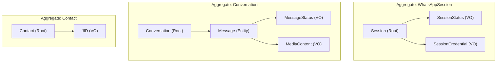

# DOC-008 · Domain Model Document

> **Status:** Draft  
> **Version:** 1.0.0  
> **Last Updated:** 2026-08-03  
> **Owner:** Domain Architect  

---

## 1. Overview

Domain model ini menggunakan prinsip **Domain-Driven Design (DDD)** yang disederhanakan — cukup yang diperlukan untuk project ini, tanpa over-engineering.

**Bounded Context:** Platform ini memiliki satu bounded context utama: **WhatsApp Messaging Platform**.

---

## 2. Aggregate Map



---

## 3. Entities

### 3.1 `WhatsAppSession`

**Aggregate Root**

```python
@dataclass
class WhatsAppSession:
    id: SessionID
    phone_number: str
    status: SessionStatus
    created_at: datetime
    last_connected_at: datetime | None
    reconnect_attempts: int
    
    def connect(self) -> "SessionConnected":
        """Transition ke status CONNECTED, return domain event."""
        ...
    
    def disconnect(self) -> "SessionDisconnected":
        """Transition ke status DISCONNECTED."""
        ...
    
    def fail(self, reason: str) -> "SessionFailed":
        """Transition ke status FAILED."""
        ...
    
    @property
    def is_active(self) -> bool:
        return self.status == SessionStatus.CONNECTED
```

**Business Rules / Invariants:**
- `reconnect_attempts` tidak boleh melebihi `MAX_RECONNECT_ATTEMPTS` (configurable)
- Transisi status hanya boleh mengikuti lifecycle yang valid (lihat State Machine di bawah)
- `phone_number` harus dalam format internasional (62xxx)

**State Machine:**
```
INITIALIZING
    |
    v
AWAITING_QR -----> CONNECTED
                       |
                       v
                  DISCONNECTING
                       |
                       v
                  DISCONNECTED <----> RECONNECTING
                       |
                       v
                    FAILED
```

---

### 3.2 `Message`

**Entity (dalam Aggregate Conversation)**

```python
@dataclass
class Message:
    id: MessageID
    conversation_id: ConversationID
    direction: MessageDirection  # INBOUND | OUTBOUND
    content: MessageContent      # Union type
    status: MessageStatus
    sent_at: datetime
    delivered_at: datetime | None
    read_at: datetime | None
    reply_to_id: MessageID | None
    
    def mark_delivered(self) -> "MessageDelivered":
        ...
    
    def mark_read(self) -> "MessageRead":
        ...
    
    def mark_failed(self, reason: str) -> "MessageFailed":
        ...
```

**Business Rules:**
- `OUTBOUND` message selalu dimulai dari status `PENDING`
- `INBOUND` message langsung berstatus `RECEIVED`
- Setelah `FAILED`, tidak bisa transisi ke status lain

---

### 3.3 `Contact`

**Aggregate Root** (sederhana)

```python
@dataclass  
class Contact:
    jid: JID           # Aggregate identifier
    display_name: str | None
    phone: str
    is_group: bool
    first_seen_at: datetime
    last_interaction_at: datetime | None
    metadata: dict[str, Any]  # Extensible untuk feature-specific data
```

---

### 3.4 `Conversation`

**Aggregate Root**

```python
@dataclass
class Conversation:
    id: ConversationID
    contact_jid: JID
    session_id: SessionID
    started_at: datetime
    last_message_at: datetime | None
    message_count: int
    is_group: bool
```

---

## 4. Value Objects

### 4.1 `JID` (Jabber ID)

```python
@dataclass(frozen=True)
class JID:
    raw: str  # e.g., "6281234567890@s.whatsapp.net"
    
    @property
    def phone(self) -> str:
        return self.raw.split("@")[0]
    
    @property
    def domain(self) -> str:
        return self.raw.split("@")[1]
    
    @property
    def is_group(self) -> bool:
        return self.domain == "g.us"
    
    @classmethod
    def from_phone(cls, phone: str) -> "JID":
        normalized = phone.lstrip("+").replace("-", "")
        return cls(raw=f"{normalized}@s.whatsapp.net")
    
    def __str__(self) -> str:
        return self.raw
```

### 4.2 `MessageStatus`

```python
class MessageStatus(str, Enum):
    PENDING = "pending"
    SENT = "sent"
    DELIVERED = "delivered"
    READ = "read"
    FAILED = "failed"
    RECEIVED = "received"  # Untuk inbound messages
```

### 4.3 `SessionStatus`

```python
class SessionStatus(str, Enum):
    INITIALIZING = "initializing"
    AWAITING_QR = "awaiting_qr"
    CONNECTED = "connected"
    DISCONNECTING = "disconnecting"
    DISCONNECTED = "disconnected"
    RECONNECTING = "reconnecting"
    FAILED = "failed"
```

### 4.4 `BotCommand`

```python
@dataclass(frozen=True)
class BotCommand:
    prefix: str       # "!"
    name: str         # "help"
    args: tuple[str, ...]  # ("menu", "food")
    raw: str          # "!help menu food"
    
    @classmethod
    def parse(cls, text: str, prefix: str = "!") -> "BotCommand | None":
        if not text.startswith(prefix):
            return None
        parts = text[len(prefix):].strip().split()
        if not parts:
            return None
        return cls(prefix=prefix, name=parts[0].lower(), args=tuple(parts[1:]), raw=text)
```

### 4.5 `MessageContent` (Union Type)

```python
@dataclass(frozen=True)
class TextContent:
    body: str

@dataclass(frozen=True)  
class MediaContent:
    mime_type: str
    file_name: str | None
    file_size: int
    caption: str | None
    url: str | None  # CDN URL setelah upload

# Union type untuk konten pesan
MessageContent = TextContent | MediaContent

# Type aliases
type MessageID = str
type SessionID = str  
type ConversationID = str
```

---

## 5. Domain Events

Semua domain events harus bersifat **immutable** dan dalam **past tense**.

### 5.1 Session Events

```python
@dataclass(frozen=True)
class SessionConnected:
    session_id: SessionID
    phone_number: str
    occurred_at: datetime = field(default_factory=datetime.utcnow)

@dataclass(frozen=True)
class SessionDisconnected:
    session_id: SessionID
    reason: str
    occurred_at: datetime = field(default_factory=datetime.utcnow)

@dataclass(frozen=True)
class SessionFailed:
    session_id: SessionID
    reason: str
    occurred_at: datetime = field(default_factory=datetime.utcnow)

@dataclass(frozen=True)
class QRCodeGenerated:
    session_id: SessionID
    qr_code: str  # Base64 encoded QR
    expires_at: datetime
    occurred_at: datetime = field(default_factory=datetime.utcnow)
```

### 5.2 Messaging Events

```python
@dataclass(frozen=True)
class MessageReceived:
    message_id: MessageID
    from_jid: JID
    session_id: SessionID
    content: MessageContent
    timestamp: datetime
    is_group: bool
    occurred_at: datetime = field(default_factory=datetime.utcnow)

@dataclass(frozen=True)
class MessageSent:
    message_id: MessageID
    to_jid: JID
    session_id: SessionID
    occurred_at: datetime = field(default_factory=datetime.utcnow)

@dataclass(frozen=True)
class MessageDelivered:
    message_id: MessageID
    occurred_at: datetime = field(default_factory=datetime.utcnow)

@dataclass(frozen=True)
class MessageRead:
    message_id: MessageID
    occurred_at: datetime = field(default_factory=datetime.utcnow)
```

### 5.3 Command Events

```python
@dataclass(frozen=True)
class CommandExecuted:
    command: BotCommand
    from_jid: JID
    session_id: SessionID
    handler_name: str
    success: bool
    occurred_at: datetime = field(default_factory=datetime.utcnow)

@dataclass(frozen=True)
class UnknownCommandReceived:
    command_name: str
    from_jid: JID
    occurred_at: datetime = field(default_factory=datetime.utcnow)
```

---

## 6. Repository Interfaces (Contracts)

Repository interfaces **hanya didefinisikan di domain layer** — implementasinya ada di infrastructure.

```python
from abc import ABC, abstractmethod

class ISessionRepository(ABC):
    @abstractmethod
    async def get_by_id(self, session_id: SessionID) -> WhatsAppSession | None: ...
    
    @abstractmethod
    async def save(self, session: WhatsAppSession) -> None: ...
    
    @abstractmethod
    async def get_active(self) -> WhatsAppSession | None: ...

class IMessageRepository(ABC):
    @abstractmethod
    async def save(self, message: Message) -> None: ...
    
    @abstractmethod
    async def get_by_id(self, message_id: MessageID) -> Message | None: ...
    
    @abstractmethod
    async def get_conversation_history(
        self, 
        conversation_id: ConversationID,
        limit: int = 50
    ) -> list[Message]: ...

class IContactRepository(ABC):
    @abstractmethod
    async def upsert(self, contact: Contact) -> None: ...
    
    @abstractmethod
    async def get_by_jid(self, jid: JID) -> Contact | None: ...
```

---

## 7. Domain Services

Domain services menangani logika bisnis yang tidak cocok di satu entity.

```python
class CommandParserService:
    """Mengekstrak BotCommand dari IncomingMessage."""
    
    def parse(
        self, 
        message_body: str, 
        prefix: str = "!"
    ) -> BotCommand | None:
        return BotCommand.parse(message_body, prefix)

class MessageNormalizerService:
    """Menormalisasi WhatsApp event ke domain objects."""
    
    def normalize_incoming(self, raw_event: dict) -> MessageReceived:
        """Map raw Neonize event ke domain event."""
        ...
```

---

## 8. Domain Exceptions

```python
class DomainException(Exception):
    """Base exception untuk semua domain errors."""
    code: str

class SessionAlreadyConnectedException(DomainException):
    code = "SESSION_ALREADY_CONNECTED"

class SessionNotFoundException(DomainException):
    code = "SESSION_NOT_FOUND"

class InvalidSessionTransitionException(DomainException):
    code = "INVALID_SESSION_TRANSITION"

class MessageSendFailedException(DomainException):
    code = "MESSAGE_SEND_FAILED"

class InvalidJIDException(DomainException):
    code = "INVALID_JID"
```

---

## References

- [DOC-002: Domain Glossary](./02_domain_glossary.md)
- [DOC-005: Architecture Overview](./05_architecture_overview.md)
- [DOC-014: Event Catalog](./12_event_catalog.md)
- [DOC-010: Data Architecture](./09_data_architecture.md)
