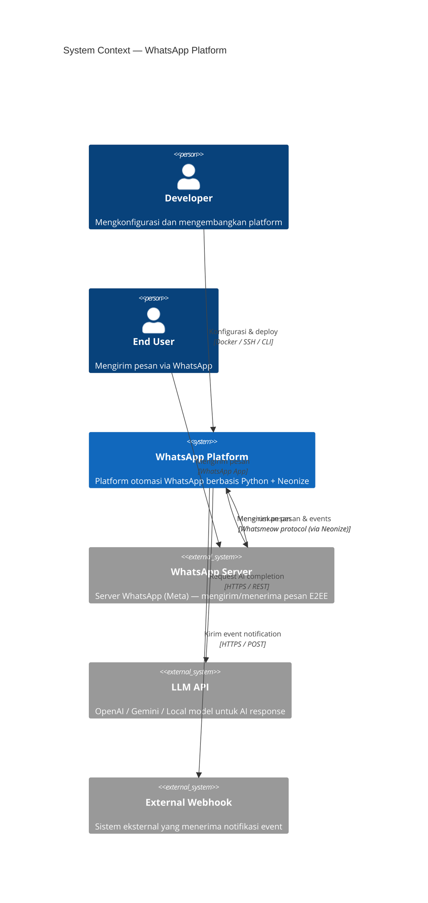
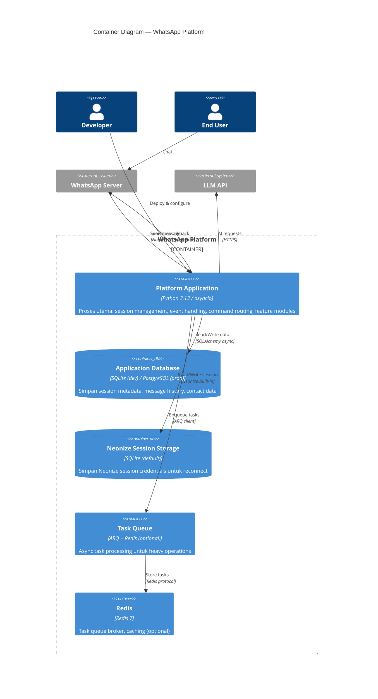
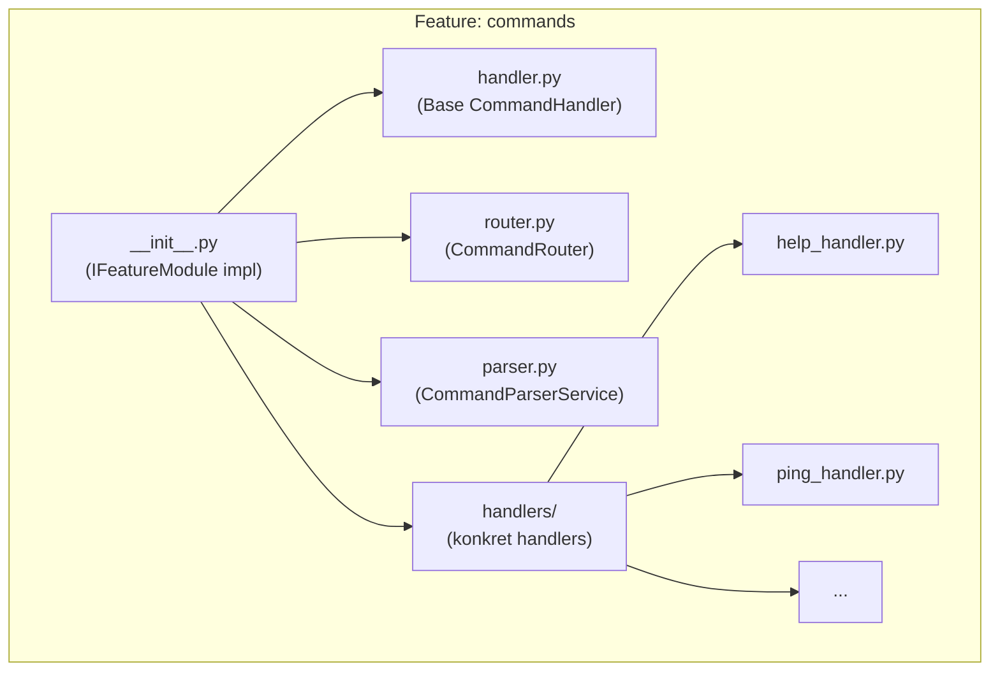
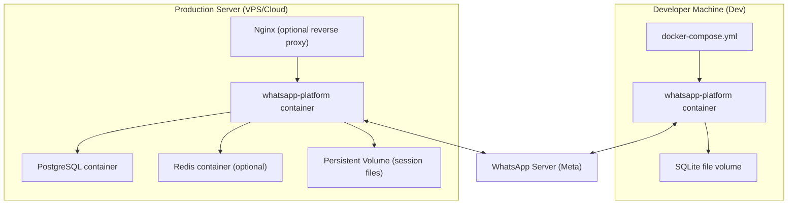
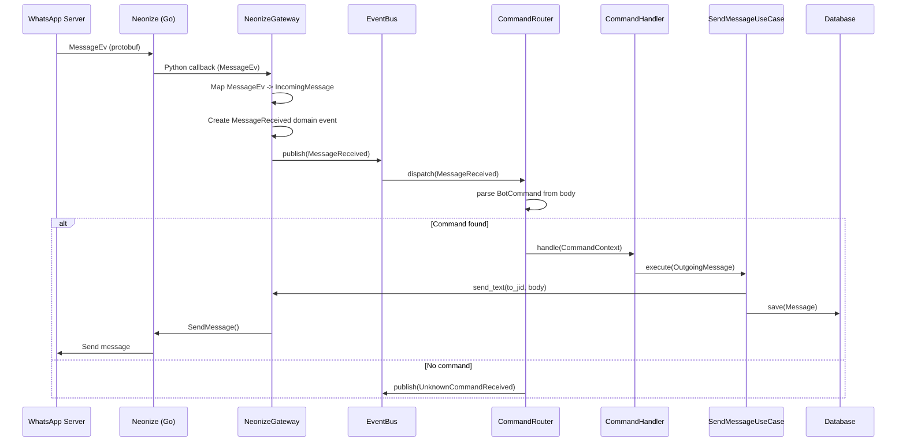
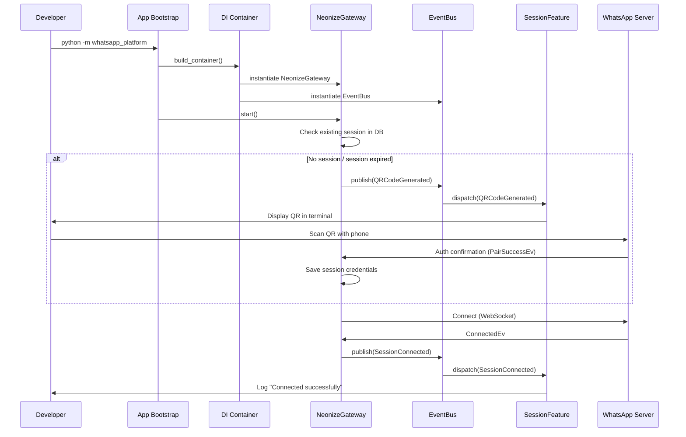

# DOC-009 · System Context Diagram & C4 Model

> **Status:** Draft  
> **Version:** 1.0.0  
> **Last Updated:** 2026-08-03  
> **Owner:** Senior Architect  

---

## C4 Model Overview

C4 Model (Simon Brown) mendokumentasikan arsitektur dalam 4 level zoom:
- **Level 1 (Context)**: Sistem kita dan hubungannya dengan dunia luar
- **Level 2 (Container)**: Aplikasi dan services yang berjalan
- **Level 3 (Component)**: Komponen dalam satu container
- **Level 4 (Code)**: Class diagram (di-generate otomatis dari kode)

---

## Level 1: System Context Diagram



---

## Level 2: Container Diagram



---

## Level 3: Component Diagram — Platform Application

```mermaid
C4Component
    title Component Diagram — Platform Application

    Container_Boundary(app, "Platform Application") {
        
        Component(bootstrap, "App Bootstrap", "app.py", "Inisialisasi semua komponen, DI wiring, lifecycle management")
        Component(container, "DI Container", "container.py", "Dependency injection — instantiate dan wire semua dependencies")

        Component_Boundary(infra, "Infrastructure Layer") {
            Component(gateway, "NeonizeGateway", "infrastructure/neonize/", "Adapter untuk Neonize library. Implements IMessagingGateway. Map Neonize events ke domain events.")
            Component(sessionRepo, "SQLAlchemySessionRepository", "infrastructure/database/", "Implements ISessionRepository. Persistence via SQLAlchemy 2.x async.")
            Component(messageRepo, "SQLAlchemyMessageRepository", "infrastructure/database/", "Implements IMessageRepository.")
            Component(config, "Settings", "infrastructure/config/", "Pydantic Settings — load & validate env vars")
            Component(logger, "StructuredLogger", "infrastructure/logging/", "structlog setup — JSON output production, pretty dev")
        }

        Component_Boundary(appLayer, "Application Layer") {
            Component(eventBus, "InMemoryEventBus", "application/", "Internal pub/sub. Dispatch domain events ke registered handlers.")
            Component(sendUC, "SendMessageUseCase", "application/use_cases/", "Orchestrate: validate -> call gateway -> save -> emit event")
            Component(sessionUC, "SessionManagementUseCase", "application/use_cases/", "Manage session lifecycle")
        }

        Component_Boundary(features, "Features Layer") {
            Component(sessionFeat, "SessionFeature", "features/session/", "Handle QR display, reconnect logic, session status reporting")
            Component(cmdRouter, "CommandRouter", "features/commands/", "Parse incoming messages, route ke CommandHandler yang sesuai")
            Component(msgFeat, "MessagingFeature", "features/messaging/", "Register handlers untuk inbound message events")
            Component(aiFeat, "AIIntegrationFeature", "features/ai_integration/", "LLM provider interface + default message handler")
        }
    }

    Rel(bootstrap, container, "Configure")
    Rel(container, gateway, "Inject")
    Rel(container, eventBus, "Inject")
    Rel(gateway, eventBus, "Publish events")
    Rel(eventBus, cmdRouter, "Dispatch MessageReceived")
    Rel(eventBus, msgFeat, "Dispatch MessageReceived")
    Rel(eventBus, sessionFeat, "Dispatch Session events")
    Rel(cmdRouter, sendUC, "Trigger send response")
    Rel(aiFeat, sendUC, "Trigger AI response")
    Rel(sendUC, gateway, "Call send")
    Rel(sendUC, messageRepo, "Save message")
    Rel(sessionUC, sessionRepo, "Save session state")
```

---

## Level 3: Component Diagram — Feature Module (Detail)

Setiap feature module memiliki struktur internal yang konsisten:



---

## Deployment Diagram



---

## Sequence Diagram: Inbound Message Flow



---

## Sequence Diagram: Session Startup Flow



---

## References

- [DOC-005: Architecture Overview](./05_architecture_overview.md)
- [DOC-008: Domain Model](./08_domain_model.md)
- [DOC-023: Deployment Plan](./21_deployment_plan.md)
