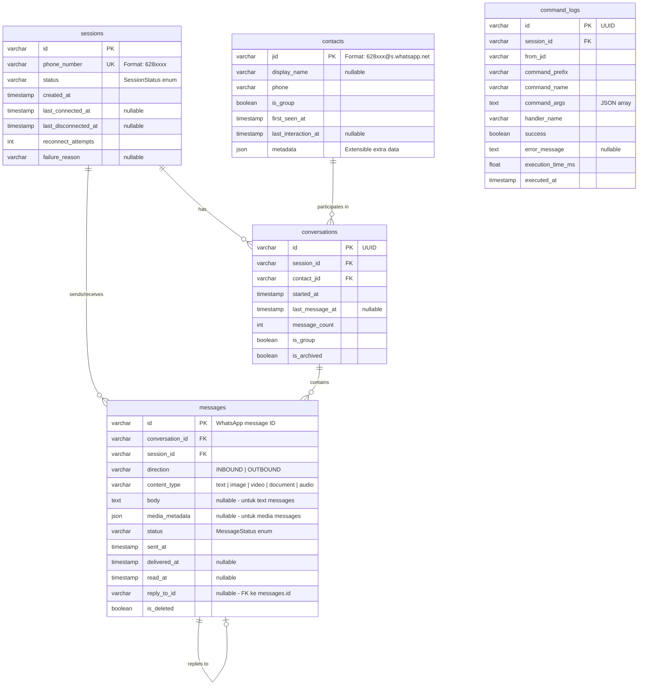

# DOC-010 · Data Architecture & Database Schema Design

> **Status:** Draft  
> **Version:** 1.0.0  
> **Last Updated:** 2026-08-03  
> **Owner:** Senior Developer + DBA  

---

## 1. Database Strategy

| Environment | Database | Driver | Rationale |
|-------------|----------|--------|-----------|
| Development | SQLite | `aiosqlite` | Zero setup, developer friendly |
| Testing | SQLite (in-memory) | `aiosqlite` | Fast, isolated per test |
| Production | PostgreSQL 16+ | `asyncpg` | ACID, concurrent writes, JSON support |

**Neonize session storage** menggunakan database terpisah yang dikelola Neonize secara internal.

---

## 2. ER Diagram



---

## 3. Schema Detail

### 3.1 Table: `sessions`

```sql
CREATE TABLE sessions (
    id                    VARCHAR(36)  PRIMARY KEY DEFAULT (gen_random_uuid()),
    phone_number          VARCHAR(20)  NOT NULL UNIQUE,
    status                VARCHAR(20)  NOT NULL DEFAULT 'initializing'
                          CHECK (status IN ('initializing', 'awaiting_qr', 'connected', 
                                           'disconnecting', 'disconnected', 'reconnecting', 'failed')),
    created_at            TIMESTAMPTZ  NOT NULL DEFAULT NOW(),
    last_connected_at     TIMESTAMPTZ,
    last_disconnected_at  TIMESTAMPTZ,
    reconnect_attempts    INTEGER      NOT NULL DEFAULT 0,
    failure_reason        TEXT
);

CREATE INDEX idx_sessions_status ON sessions(status);
CREATE INDEX idx_sessions_phone ON sessions(phone_number);
```

### 3.2 Table: `contacts`

```sql
CREATE TABLE contacts (
    jid                 VARCHAR(100) PRIMARY KEY,
    display_name        VARCHAR(255),
    phone               VARCHAR(20)  NOT NULL,
    is_group            BOOLEAN      NOT NULL DEFAULT FALSE,
    first_seen_at       TIMESTAMPTZ  NOT NULL DEFAULT NOW(),
    last_interaction_at TIMESTAMPTZ,
    metadata            JSONB        NOT NULL DEFAULT '{}'
);

CREATE INDEX idx_contacts_phone ON contacts(phone);
CREATE INDEX idx_contacts_is_group ON contacts(is_group);
```

### 3.3 Table: `conversations`

```sql
CREATE TABLE conversations (
    id               VARCHAR(36)  PRIMARY KEY DEFAULT (gen_random_uuid()),
    session_id       VARCHAR(36)  NOT NULL REFERENCES sessions(id) ON DELETE CASCADE,
    contact_jid      VARCHAR(100) NOT NULL REFERENCES contacts(jid),
    started_at       TIMESTAMPTZ  NOT NULL DEFAULT NOW(),
    last_message_at  TIMESTAMPTZ,
    message_count    INTEGER      NOT NULL DEFAULT 0,
    is_group         BOOLEAN      NOT NULL DEFAULT FALSE,
    is_archived      BOOLEAN      NOT NULL DEFAULT FALSE,
    
    UNIQUE (session_id, contact_jid)
);

CREATE INDEX idx_conversations_session ON conversations(session_id);
CREATE INDEX idx_conversations_contact ON conversations(contact_jid);
CREATE INDEX idx_conversations_last_msg ON conversations(last_message_at DESC);
```

### 3.4 Table: `messages`

```sql
CREATE TABLE messages (
    id               VARCHAR(100) PRIMARY KEY,  -- WhatsApp message ID
    conversation_id  VARCHAR(36)  NOT NULL REFERENCES conversations(id),
    session_id       VARCHAR(36)  NOT NULL REFERENCES sessions(id),
    direction        VARCHAR(10)  NOT NULL CHECK (direction IN ('inbound', 'outbound')),
    content_type     VARCHAR(20)  NOT NULL DEFAULT 'text'
                     CHECK (content_type IN ('text', 'image', 'video', 'document', 'audio', 'sticker', 'poll')),
    body             TEXT,
    media_metadata   JSONB,
    status           VARCHAR(20)  NOT NULL DEFAULT 'pending'
                     CHECK (status IN ('pending', 'sent', 'delivered', 'read', 'failed', 'received')),
    sent_at          TIMESTAMPTZ  NOT NULL,
    delivered_at     TIMESTAMPTZ,
    read_at          TIMESTAMPTZ,
    reply_to_id      VARCHAR(100) REFERENCES messages(id),
    is_deleted       BOOLEAN      NOT NULL DEFAULT FALSE,
    
    CONSTRAINT chk_content_body CHECK (
        content_type = 'text' AND body IS NOT NULL
        OR content_type != 'text'
    )
);

CREATE INDEX idx_messages_conversation ON messages(conversation_id, sent_at DESC);
CREATE INDEX idx_messages_session ON messages(session_id);
CREATE INDEX idx_messages_status ON messages(status);
CREATE INDEX idx_messages_sent_at ON messages(sent_at DESC);
```

### 3.5 Table: `command_logs`

```sql
CREATE TABLE command_logs (
    id                VARCHAR(36)   PRIMARY KEY DEFAULT (gen_random_uuid()),
    session_id        VARCHAR(36)   NOT NULL REFERENCES sessions(id),
    from_jid          VARCHAR(100)  NOT NULL,
    command_prefix    VARCHAR(5)    NOT NULL,
    command_name      VARCHAR(100)  NOT NULL,
    command_args      JSONB         NOT NULL DEFAULT '[]',
    handler_name      VARCHAR(200)  NOT NULL,
    success           BOOLEAN       NOT NULL,
    error_message     TEXT,
    execution_time_ms FLOAT,
    executed_at       TIMESTAMPTZ   NOT NULL DEFAULT NOW()
);

CREATE INDEX idx_cmd_logs_session ON command_logs(session_id, executed_at DESC);
CREATE INDEX idx_cmd_logs_command ON command_logs(command_name);
CREATE INDEX idx_cmd_logs_success ON command_logs(success);
```

---

## 4. SQLAlchemy Models (ORM)

```python
# infrastructure/database/models.py

from sqlalchemy import String, Boolean, Integer, DateTime, Text, Float, JSON
from sqlalchemy.orm import DeclarativeBase, Mapped, mapped_column
from datetime import datetime

class Base(DeclarativeBase):
    pass

class SessionModel(Base):
    __tablename__ = "sessions"
    
    id: Mapped[str] = mapped_column(String(36), primary_key=True)
    phone_number: Mapped[str] = mapped_column(String(20), unique=True)
    status: Mapped[str] = mapped_column(String(20), default="initializing")
    created_at: Mapped[datetime] = mapped_column(DateTime(timezone=True))
    last_connected_at: Mapped[datetime | None] = mapped_column(DateTime(timezone=True))
    last_disconnected_at: Mapped[datetime | None] = mapped_column(DateTime(timezone=True))
    reconnect_attempts: Mapped[int] = mapped_column(Integer, default=0)
    failure_reason: Mapped[str | None] = mapped_column(Text)

class ContactModel(Base):
    __tablename__ = "contacts"
    
    jid: Mapped[str] = mapped_column(String(100), primary_key=True)
    display_name: Mapped[str | None] = mapped_column(String(255))
    phone: Mapped[str] = mapped_column(String(20))
    is_group: Mapped[bool] = mapped_column(Boolean, default=False)
    first_seen_at: Mapped[datetime] = mapped_column(DateTime(timezone=True))
    last_interaction_at: Mapped[datetime | None] = mapped_column(DateTime(timezone=True))
    metadata_: Mapped[dict] = mapped_column("metadata", JSON, default=dict)

class ConversationModel(Base):
    __tablename__ = "conversations"
    
    id: Mapped[str] = mapped_column(String(36), primary_key=True)
    session_id: Mapped[str] = mapped_column(String(36))
    contact_jid: Mapped[str] = mapped_column(String(100))
    started_at: Mapped[datetime] = mapped_column(DateTime(timezone=True))
    last_message_at: Mapped[datetime | None] = mapped_column(DateTime(timezone=True))
    message_count: Mapped[int] = mapped_column(Integer, default=0)
    is_group: Mapped[bool] = mapped_column(Boolean, default=False)
    is_archived: Mapped[bool] = mapped_column(Boolean, default=False)

class MessageModel(Base):
    __tablename__ = "messages"
    
    id: Mapped[str] = mapped_column(String(100), primary_key=True)
    conversation_id: Mapped[str] = mapped_column(String(36))
    session_id: Mapped[str] = mapped_column(String(36))
    direction: Mapped[str] = mapped_column(String(10))
    content_type: Mapped[str] = mapped_column(String(20), default="text")
    body: Mapped[str | None] = mapped_column(Text)
    media_metadata: Mapped[dict | None] = mapped_column(JSON)
    status: Mapped[str] = mapped_column(String(20), default="pending")
    sent_at: Mapped[datetime] = mapped_column(DateTime(timezone=True))
    delivered_at: Mapped[datetime | None] = mapped_column(DateTime(timezone=True))
    read_at: Mapped[datetime | None] = mapped_column(DateTime(timezone=True))
    reply_to_id: Mapped[str | None] = mapped_column(String(100))
    is_deleted: Mapped[bool] = mapped_column(Boolean, default=False)
```

---

## 5. Alembic Migration Strategy

### Setup
```bash
# Initialize Alembic
uv run alembic init migrations

# Create migration
uv run alembic revision --autogenerate -m "initial_schema"

# Apply migrations
uv run alembic upgrade head

# Rollback
uv run alembic downgrade -1
```

### Migration Rules
1. Setiap perubahan schema HARUS melalui migration file
2. Migration TIDAK BOLEH berisi data manipulation yang berbahaya tanpa review
3. Setiap migration HARUS memiliki `downgrade()` function yang berfungsi
4. Migration dijalankan otomatis di startup aplikasi (setelah review di CI)

---

## 6. Data Retention Policy

| Data | Retention | Alasan |
|------|-----------|--------|
| Sessions | Permanent (selama session aktif) | Diperlukan untuk reconnect |
| Messages | 90 hari (default, configurable) | Storage efficiency |
| Command Logs | 30 hari | Analytics, debugging |
| Contacts | Permanent | Referential integrity |
| Media files | Tidak disimpan (hanya metadata) | CDN URL dari WhatsApp |

### Cleanup Job (Future)
```python
# Dijalankan via scheduler setiap hari pukul 02:00
async def cleanup_old_messages(db: AsyncSession, retention_days: int = 90) -> None:
    cutoff = datetime.utcnow() - timedelta(days=retention_days)
    await db.execute(
        delete(MessageModel).where(MessageModel.sent_at < cutoff)
    )
```

---

## 7. Backup Strategy

| Environment | Strategy | Frequency |
|-------------|----------|-----------|
| Development | Manual (tidak kritis) | — |
| Production | Automated dump | Setiap 6 jam |
| Session credentials | Neonize handles internally | — |

---

## References

- [DOC-008: Domain Model](./08_domain_model.md)
- [DOC-005: Architecture Overview](./05_architecture_overview.md)
- [SQLAlchemy 2.x Docs](https://docs.sqlalchemy.org/en/20/)
- [Alembic Docs](https://alembic.sqlalchemy.org/)
