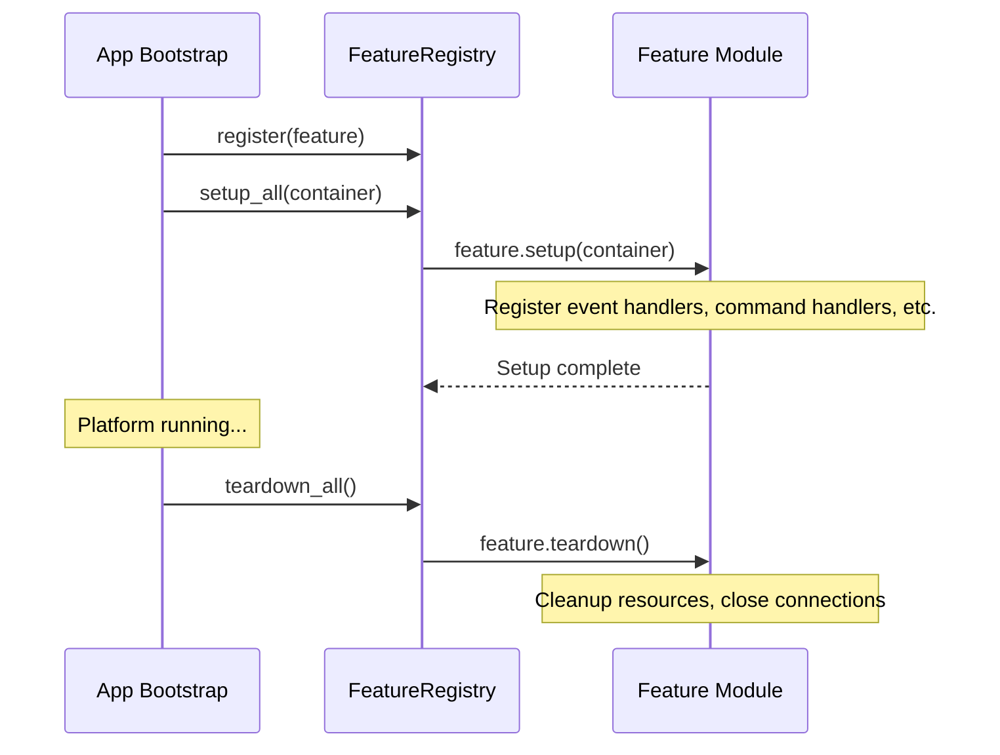

# DOC-012 · Feature Specification Documents

> **Status:** Draft  
> **Version:** 1.0.0  
> **Last Updated:** 2026-08-03  
> **Owner:** Developer + System Analyst  

---

## Overview

Setiap feature memiliki spesifikasi mandiri yang menjelaskan tanggung jawab, komponen, dan kontrak internalnya.

---

## Feature: `session` (FEAT-001)

### Tanggung Jawab
Mengelola seluruh lifecycle koneksi WhatsApp: startup, QR pairing, reconnect, shutdown.

### Komponen Internal

| File | Kelas/Fungsi | Tanggung Jawab |
|------|-------------|----------------|
| `__init__.py` | `SessionFeature(IFeatureModule)` | Entry point, register handlers |
| `manager.py` | `SessionManager` | Orchestrate lifecycle, reconnect logic |
| `qr_handler.py` | `QRDisplayHandler` | Display QR ke terminal / callback |
| `reconnect.py` | `ExponentialBackoffReconnector` | Reconnect dengan backoff strategy |
| `status.py` | `SessionStatusReporter` | Log dan expose session status |

### Events Produced

| Event | Trigger |
|-------|---------|
| `QRCodeGenerated` | QR baru di-generate |
| `SessionConnected` | Koneksi berhasil |
| `SessionDisconnected` | Koneksi terputus |
| `SessionFailed` | Max reconnect attempts tercapai |

### Events Consumed

| Event | Handler | Action |
|-------|---------|--------|
| `QRCodeGenerated` | `QRDisplayHandler` | Print QR ke terminal |
| `SessionDisconnected` | `SessionManager` | Trigger reconnect flow |

### Configuration

```python
SESSION_MAX_RECONNECT_ATTEMPTS: int = 5
SESSION_RECONNECT_BACKOFF_MAX: int = 60  # seconds
SESSION_QR_TIMEOUT: int = 60  # seconds
SESSION_QR_MAX_ATTEMPTS: int = 3
```

---

## Feature: `messaging` (FEAT-002)

### Tanggung Jawab
Abstraksi untuk send dan receive pesan. Menyediakan high-level API untuk fitur lain.

### Komponen Internal

| File | Kelas/Fungsi | Tanggung Jawab |
|------|-------------|----------------|
| `__init__.py` | `MessagingFeature(IFeatureModule)` | Entry point |
| `sender.py` | `MessageSender` | High-level send API (text, image, doc, audio) |
| `receiver.py` | `MessageReceiver` | Process inbound messages, normalization |
| `normalizer.py` | `NeonizeMessageNormalizer` | Map Neonize events → domain objects |
| `media.py` | `MediaProcessor` | Download/encode media |

### Public API (untuk digunakan feature lain)

```python
class MessageSender:
    async def send_text(self, to: JID, body: str) -> MessageID: ...
    async def reply_text(self, to: JID, reply_to: MessageID, body: str) -> MessageID: ...
    async def send_image(self, to: JID, path: Path, caption: str | None = None) -> MessageID: ...
    async def send_document(self, to: JID, path: Path, filename: str | None = None) -> MessageID: ...
```

### Events Produced

| Event | Trigger |
|-------|---------|
| `MessageReceived` | Pesan masuk dari Neonize |
| `MessageSent` | Pesan berhasil dikirim |
| `MessageDelivered` | Receipt dari WhatsApp (delivered) |
| `MessageRead` | Receipt dari WhatsApp (read) |

---

## Feature: `commands` (FEAT-003)

### Tanggung Jawab
Command parsing, routing, dan handler management.

### Komponen Internal

| File | Kelas/Fungsi | Tanggung Jawab |
|------|-------------|----------------|
| `__init__.py` | `CommandsFeature(IFeatureModule)` | Entry point, register default handlers |
| `router.py` | `CommandRouter` | Route IncomingMessage ke CommandHandler |
| `parser.py` | `CommandParserService` | Parse body → BotCommand |
| `context.py` | `CommandContext` | Context object untuk handlers |
| `base.py` | `BaseCommandHandler` | Abstract base class |
| `registry.py` | `CommandHandlerRegistry` | CRUD untuk registered handlers |
| `handlers/ping.py` | `PingHandler` | Built-in: reply "pong" |
| `handlers/help.py` | `HelpHandler` | Built-in: list all commands |

### Handler Registration Pattern

```python
# Di feature module lain, bisa register command:
class AIFeature(IFeatureModule):
    async def setup(self, container: IContainer) -> None:
        command_registry = container.resolve(CommandHandlerRegistry)
        command_registry.register(
            command_name="ask",
            handler=AskAIHandler(ai_provider=container.resolve(IAIProvider)),
            aliases=["ai", "chat"],
            description="Ask AI a question",
            usage="!ask <pertanyaan>"
        )
```

### Built-in Commands

| Command | Aliases | Description | Args |
|---------|---------|-------------|------|
| `!ping` | `!p` | Health check, reply "pong" | None |
| `!help` | `!h`, `!?` | List all commands | `[command_name]` |

---

## Feature: `ai_integration` (FEAT-004)

### Tanggung Jawab
Integrasi LLM (Large Language Model) sebagai default message handler atau via command.

### Komponen Internal

| File | Kelas/Fungsi | Tanggung Jawab |
|------|-------------|----------------|
| `__init__.py` | `AIIntegrationFeature(IFeatureModule)` | Entry point |
| `providers/base.py` | `IAIProvider(Protocol)` | Interface untuk LLM provider |
| `providers/openai.py` | `OpenAIProvider` | OpenAI GPT implementation |
| `providers/gemini.py` | `GeminiProvider` | Google Gemini implementation |
| `providers/noop.py` | `NoopAIProvider` | Dummy provider (jika AI disabled) |
| `context_builder.py` | `ConversationContextBuilder` | Build prompt dengan history |
| `use_cases/ask.py` | `AskAIUseCase` | Orchestrate AI request |

### IAIProvider Interface

```python
class IAIProvider(Protocol):
    async def complete(
        self,
        messages: list[ChatMessage],
        max_tokens: int = 500,
        temperature: float = 0.7,
    ) -> str: ...
    
    @property
    def model_name(self) -> str: ...
    
    @property  
    def is_available(self) -> bool: ...

@dataclass(frozen=True)
class ChatMessage:
    role: Literal["system", "user", "assistant"]
    content: str
```

### Configuration

```python
AI_PROVIDER: str = "none"         # none | openai | gemini
AI_MODEL: str = "gpt-4o-mini"    # model name
AI_MAX_TOKENS: int = 500
AI_TEMPERATURE: float = 0.7
AI_SYSTEM_PROMPT: str = "You are a helpful WhatsApp assistant."
AI_CONTEXT_MESSAGES: int = 10    # berapa pesan history yang dikirim ke LLM
OPENAI_API_KEY: SecretStr | None = None
GEMINI_API_KEY: SecretStr | None = None
```

---

## Feature: `scheduler` (FEAT-005) — Future

### Tanggung Jawab
Mengirim pesan terjadwal dan broadcast ke daftar kontak.

### Komponen Internal (Draft)

| File | Kelas/Fungsi | Tanggung Jawab |
|------|-------------|----------------|
| `__init__.py` | `SchedulerFeature(IFeatureModule)` | Entry point |
| `scheduler.py` | `MessageScheduler` | Manage scheduled tasks |
| `broadcast.py` | `BroadcastService` | Kirim ke banyak kontak |
| `models.py` | `ScheduledMessage` | Entity untuk pesan terjadwal |

---

## Feature: `webhooks` (FEAT-006) — Future

### Tanggung Jawab
Mengirim event notifications ke URL eksternal (outbound webhook).

### Komponen Internal (Draft)

| File | Kelas/Fungsi | Tanggung Jawab |
|------|-------------|----------------|
| `__init__.py` | `WebhooksFeature(IFeatureModule)` | Entry point |
| `dispatcher.py` | `WebhookDispatcher` | Send HTTP POST ke webhook URLs |
| `models.py` | `WebhookConfig` | Configuration per webhook |
| `retry.py` | `WebhookRetryPolicy` | Retry logic dengan backoff |

---

## Feature Module Lifecycle



---

## References

- [DOC-005: Architecture Overview](./05_architecture_overview.md)
- [DOC-008: Domain Model](./08_domain_model.md)
- [DOC-014: Event Catalog](./12_event_catalog.md)
- [DOC-017: Project Structure](./15_project_structure.md)
