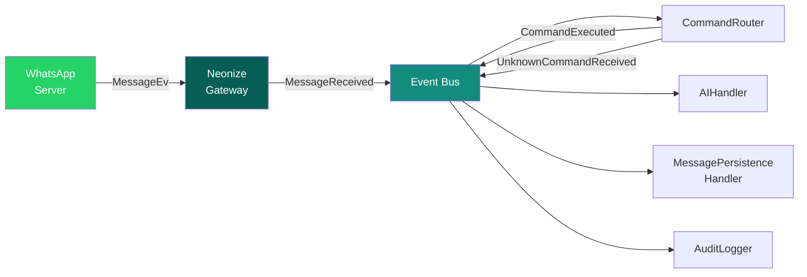

# DOC-014 · Event Catalog (Event-Driven Design)

> **Status:** Draft  
> **Version:** 1.0.0  
> **Last Updated:** 2026-08-03  
> **Owner:** Senior Architect + Developer  

---

## 1. Prinsip Event Design

1. **Past tense**: Semua event dalam past tense (`MessageReceived`, bukan `ReceiveMessage`)
2. **Immutable**: Event adalah frozen dataclass — tidak bisa diubah setelah dibuat
3. **Self-contained**: Event mengandung semua data yang dibutuhkan handler-nya
4. **Timestamped**: Setiap event memiliki `occurred_at: datetime`
5. **Typed**: Tidak ada `dict` atau untyped payload
6. **No side effects in producer**: Producer hanya emit event, tidak tahu apa yang terjadi setelahnya

---

## 2. Base Event

```python
from dataclasses import dataclass, field
from datetime import datetime
from uuid import uuid4

@dataclass(frozen=True)
class DomainEvent:
    """Base class untuk semua domain events."""
    event_id: str = field(default_factory=lambda: str(uuid4()))
    occurred_at: datetime = field(default_factory=datetime.utcnow)
```

---

## 3. Session Events

### `QRCodeGenerated`

```python
@dataclass(frozen=True)
class QRCodeGenerated(DomainEvent):
    session_id: SessionID
    qr_code: str          # Raw QR code string (untuk di-convert ke ASCII art)
    qr_code_image: bytes  # PNG bytes (untuk display di terminal / webhook)
    expires_at: datetime
```

| Field | Producer | Consumers |
|-------|----------|-----------|
| Session startup tanpa saved session | `NeonizeGateway` | `QRDisplayHandler` (terminal print), `WebhookDispatcher` (future) |

---

### `SessionAuthenticated`

```python
@dataclass(frozen=True)
class SessionAuthenticated(DomainEvent):
    session_id: SessionID
    phone_number: str
    device_name: str | None
```

| Producer | Consumers |
|----------|-----------|
| `NeonizeGateway` (on PairSuccessEv) | `SessionManager` (save session ke DB) |

---

### `SessionConnected`

```python
@dataclass(frozen=True)
class SessionConnected(DomainEvent):
    session_id: SessionID
    phone_number: str
    reconnect_attempt: int  # 0 = first connect, >0 = reconnect
```

| Producer | Consumers |
|----------|-----------|
| `NeonizeGateway` (on ConnectedEv) | `SessionManager` (update status), `StructuredLogger`, `HealthReporter` |

---

### `SessionDisconnected`

```python
@dataclass(frozen=True)
class SessionDisconnected(DomainEvent):
    session_id: SessionID
    reason: str
    was_graceful: bool  # True = kita yang disconnect, False = unexpected
```

| Producer | Consumers |
|----------|-----------|
| `NeonizeGateway` (on DisconnectedEv) | `ReconnectManager` (trigger reconnect jika !was_graceful), `SessionManager` (update status) |

---

### `SessionFailed`

```python
@dataclass(frozen=True)
class SessionFailed(DomainEvent):
    session_id: SessionID
    reason: str
    total_reconnect_attempts: int
```

| Producer | Consumers |
|----------|-----------|
| `ReconnectManager` (max attempts reached) | `StructuredLogger` (CRITICAL log), `AlertSender` (future) |

---

## 4. Messaging Events

### `MessageReceived`

```python
@dataclass(frozen=True)
class MessageReceived(DomainEvent):
    message_id: MessageID
    session_id: SessionID
    from_jid: JID
    conversation_id: ConversationID
    content_type: str              # "text" | "image" | "video" | "document" | "audio"
    body: str | None               # Untuk text messages
    media_metadata: dict | None    # Untuk media messages
    raw_sender_name: str | None    # Display name dari WhatsApp
    is_group: bool
    reply_to_id: MessageID | None
    timestamp: datetime            # Waktu pesan dikirim oleh pengirim
```

| Producer | Consumers |
|----------|-----------|
| `NeonizeGateway` (on MessageEv) | `CommandRouter`, `AIIntegrationHandler`, `MessagePersistenceHandler`, `AuditLogger`, `WebhookDispatcher` (future) |

---

### `MessageSent`

```python
@dataclass(frozen=True)
class MessageSent(DomainEvent):
    message_id: MessageID
    session_id: SessionID
    to_jid: JID
    content_type: str
```

| Producer | Consumers |
|----------|-----------|
| `SendMessageUseCase` | `MessagePersistenceHandler` (save ke DB), `MetricsCollector` |

---

### `MessageDelivered`

```python
@dataclass(frozen=True)
class MessageDelivered(DomainEvent):
    message_id: MessageID
    session_id: SessionID
    to_jid: JID
```

| Producer | Consumers |
|----------|-----------|
| `NeonizeGateway` (on ReceiptEv delivered) | `MessagePersistenceHandler` (update status), `WebhookDispatcher` (future) |

---

### `MessageRead`

```python
@dataclass(frozen=True)
class MessageRead(DomainEvent):
    message_id: MessageID
    session_id: SessionID
    by_jid: JID
    timestamp: datetime
```

| Producer | Consumers |
|----------|-----------|
| `NeonizeGateway` (on ReceiptEv read) | `MessagePersistenceHandler` (update status) |

---

## 5. Command Events

### `CommandExecuted`

```python
@dataclass(frozen=True)
class CommandExecuted(DomainEvent):
    command: BotCommand
    session_id: SessionID
    from_jid: JID
    handler_name: str
    success: bool
    execution_time_ms: float
    error_message: str | None = None
```

| Producer | Consumers |
|----------|-----------|
| `CommandRouter` (after handler.handle()) | `CommandLogger` (save ke command_logs), `MetricsCollector` |

---

### `UnknownCommandReceived`

```python
@dataclass(frozen=True)
class UnknownCommandReceived(DomainEvent):
    command_name: str
    session_id: SessionID
    from_jid: JID
    raw_message: str
```

| Producer | Consumers |
|----------|-----------|
| `CommandRouter` (no handler found) | `UnknownCommandHandler` (kirim pesan "command tidak dikenal") |

---

## 6. Event Flow Diagram



---

## 7. Event Bus: Behavior Specification

### Concurrency Model
```
publish(event) dipanggil:
  1. Cari semua handlers yang subscribe ke event_type
  2. Jalankan SEMUA handlers secara concurrent: asyncio.gather(*[h(event) for h in handlers])
  3. Jika satu handler error:
     - Log ERROR dengan traceback
     - Handler lain TETAP berjalan
     - Exception dari handler yang error TIDAK dipropagasikan ke publisher
```

### Subscription Matching
```
Exact type matching: subscribe(MessageReceived, handler)
  → hanya dipanggil untuk event type MessageReceived SAJA
  
Tidak ada wildcard subscription (untuk simplicity di MVP)
```

### Thread Safety
```
InMemoryEventBus tidak perlu thread-safe
(semua kode berjalan dalam satu asyncio event loop)
```

---

## 8. Event Type Registry

| Event Class | Category | Publisher | # of Subscribers |
|-------------|----------|-----------|------------------|
| `QRCodeGenerated` | Session | NeonizeGateway | 1 |
| `SessionAuthenticated` | Session | NeonizeGateway | 1 |
| `SessionConnected` | Session | NeonizeGateway | 3 |
| `SessionDisconnected` | Session | NeonizeGateway | 2 |
| `SessionFailed` | Session | ReconnectManager | 2 |
| `MessageReceived` | Messaging | NeonizeGateway | 4+ |
| `MessageSent` | Messaging | SendMessageUseCase | 2 |
| `MessageDelivered` | Messaging | NeonizeGateway | 2 |
| `MessageRead` | Messaging | NeonizeGateway | 1 |
| `CommandExecuted` | Command | CommandRouter | 2 |
| `UnknownCommandReceived` | Command | CommandRouter | 1 |

---

## References

- [DOC-005: Architecture Overview](./05_architecture_overview.md)
- [DOC-008: Domain Model](./08_domain_model.md)
- [DOC-013: API Contract](./13_api_contract.md)
- [DOC-012: Feature Specifications](./12_feature_specifications.md)
