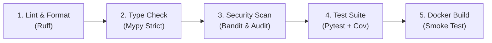

# DOC-022 · DevOps & CI/CD Pipeline Specification

> **Status:** Draft  
> **Version:** 1.0.0  
> **Last Updated:** 2026-08-03  
> **Owner:** DevOps Engineer  

---

## 1. Branching & Workflow Strategy

Menggunakan **Trunk-Based Development** (dengan short-lived feature branches):

- `main` : Production-ready branch. Dilindungi oleh Branch Protection Rules.
- `feat/*` : Feature branch (contoh: `feat/add-ai-provider`).
- `fix/*` : Bug fix branch (contoh: `fix/reconnect-backoff`).

### Conventional Commits Format
Setiap commit harus mengikuti aturan:
`<type>(<scope>): <short description>`

Contoh:
- `feat(messaging): add support for document sending`
- `fix(session): resolve infinite reconnect loop on network drop`
- `docs(adr): add ADR-008 for uv package manager`

---

## 2. GitHub Actions CI Pipeline (`.github/workflows/ci.yml`)

Setiap Pull Request ke `main` akan memicu pipeline otomatis dengan 5 tahapan:



---

## 3. GitHub Actions Configuration Reference

```yaml
name: CI Pipeline

on:
  push:
    branches: [ main ]
  pull_request:
    branches: [ main ]

jobs:
  validate:
    runs-on: ubuntu-latest
    steps:
      - uses: actions/checkout@v4

      - name: Install uv
        uses: astral-sh/setup-uv@v3
        with:
          version: "latest"

      - name: Set up Python
        uses: actions/setup-python@v5
        with:
          python-version: "3.13"

      - name: Install dependencies
        run: uv sync --frozen

      - name: Run Linter (Ruff)
        run: uv run ruff check .

      - name: Run Format Check (Ruff)
        run: uv run ruff format --check .

      - name: Run Type Checker (Mypy)
        run: uv run mypy src

      - name: Security Scan (Bandit & Audit)
        run: |
          uv run bandit -r src/
          uv run pip-audit

      - name: Run Test Suite & Coverage
        run: uv run pytest --cov=src --cov-fail-under=80
```

---

## References

- [DOC-006: Tech Stack](./06_tech_stack.md)
- [DOC-018: Coding Standards](./16_coding_standards.md)
- [DOC-020: Testing Strategy](./18_testing_strategy.md)
