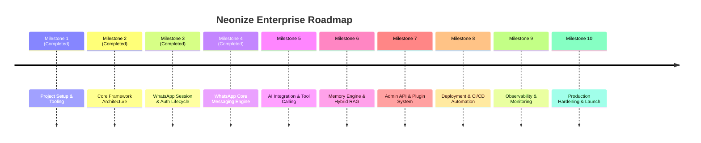

# 🗺️ Master Development Roadmap: Neonize Enterprise Platform

> **Target Platform:** Python 3.13+ • Neonize • Clean Architecture • Enterprise-Grade  
> **Status:** Active Implementation (Core Platform Completed)  
> **Version:** 2.1.0  
> **Last Updated:** 2026-08-07  

---

## 📌 Roadmap Overview

---

## 🎯 Detailed Milestones & Actionable Checklists

### 🚀 Milestone 1: Project Setup & Tooling (Completed)
*Fokus: Menginisialisasi repositori, struktur folder Clean Architecture, manajemen dependensi, dan kualitas kode.*

- [x] **Project Initialization:**
  - [x] Inisialisasi Python 3.13+ project menggunakan `uv`.
  - [x] Buat file `pyproject.toml` dengan metadata dan dependensi utama.
- [x] **Folder Structure:**
  - [x] Buat arsitektur direktori Clean Architecture (`src/`, `tests/`, `docker/`, `deployment/`, `storage/`, `assets/`, `logs/`).
  - [x] Inisialisasi `__init__.py` dan `.gitkeep` di setiap sub-package.
- [x] **Developer Quality Tooling:**
  - [x] Konfigurasi `Ruff` untuk linter dan formatting (`line-length = 88`).
  - [x] Konfigurasi `Mypy` dan `Pyright` dalam mode strict (`strict = true`).
  - [x] Konfigurasi `pytest` dan `pytest-asyncio`.
  - [x] Pasang `pre-commit` hooks (`ruff`, `mypy`, `check-yaml`).
- [x] **Config Management:**
  - [x] Buat `src/whatsapp_platform/infrastructure/config/settings.py` menggunakan Pydantic Settings v2.
  - [x] Buat file `.env.example` untuk kredensial environment.

---

### 🏛️ Milestone 2: Core Framework Architecture (Completed)
*Fokus: Membangun pondasi layer Domain, Application, Event Bus, dan Persistensi Database.*

- [x] **Domain Layer Foundations:**
  - [x] Definisikan core entities (`Session`, `Message`, `Contact`, `Conversation`).
  - [x] Definisikan Value Objects (`JID`, `MessageStatus`, `SessionStatus`, `BotCommand`, `MessageContent`).
  - [x] Buat hirarki Custom Exceptions (`DomainException`, `GatewayException`, `InvalidJIDError`, etc.).
- [x] **Application Layer Foundations:**
  - [x] Definisikan Abstract Interfaces (`IMessagingGateway`, `ISessionRepository`, `IMessageRepository`, `IConversationRepository`, `IContactRepository`).
  - [x] Buat In-Memory Async Event Bus (`EventBus`) untuk pub/sub internal domain events dengan exception isolation.
  - [x] Buat `FeatureRegistry` lifecycle orchestrator (`IFeatureModule`).
- [x] **Dependency Injection & Persistence Setup:**
  - [x] Konfigurasi Container Dependency Injection (`Container`).
  - [x] Setup SQLAlchemy 2.0 Async Engine & `async_sessionmaker` factory.
  - [x] Setup Alembic DB Migrations (`alembic/`) untuk SQLite database (`storage/platform.db`).

---

### 🔑 Milestone 3: Authentication & Session Lifecycle (Completed)
*Fokus: Mengintegrasikan Neonize client, penanganan QR Code pairing, dan auto-reconnect.*

- [x] **Neonize Gateway Adapter:**
  - [x] Implementasikan `NeonizeGateway` yang membungkus client Whatsmeow Go engine dan menjembatani event loop thread terpisah ke asyncio.
  - [x] Setup persistent SQLite storage untuk kunci sesi WhatsApp (`default_session`).
- [x] **QR Code Pairing Handler:**
  - [x] Implementasikan Terminal ASCII QR renderer dan event mapper (`NeonizeEventMapper.map_qr_ev`).
- [x] **Session Reconnection Engine:**
  - [x] Buat handler event lifecycle WhatsApp (`ConnectedEv`, `DisconnectedEv`, `LoggedOutEv`, `QREv`, `PairStatusEv`).
  - [x] Emit domain event (`SessionConnected`, `SessionDisconnected`, `SessionQRCodeReceived`) ke Event Bus via setter injection.

---

### 💬 Milestone 4: WhatsApp Core Messaging Engine (Completed)
*Fokus: Pemrosesan pesan masuk/keluar, handling media (gambar/audio/PDF), dan Command Router.*

- [x] **Inbound/Outbound Message Processing:**
  - [x] Hubungkan Neonize event `@client.event(MessageEv)` ke Presentation/Feature Layer.
  - [x] Implementasikan `SendMessageUseCase` dan `ReceiveMessageUseCase`.
  - [x] Persistence & update ke aggregate root `Conversation` (unread_count, last_message).
- [x] **Media Handling:**
  - [x] Implementasikan `MediaProcessor` helper.
  - [x] Pemrosesan dan OCR gambar (`pytesseract`/`easyocr`).
  - [x] Parsing dokumen PDF (`PyPDF`/`pdfplumber`/`PyMuPDF`).
  - [x] Pipeline pengolahan transkripsi audio (`whisper`).
- [x] **Command Router & Feature:**
  - [x] Buat `CommandsFeature` dan `CommandRouter` (`!ping`, `!help`, `!echo`, `!info`, `!group`).
  - [x] Dispatch domain event (`CommandReceived`, `CommandExecuted`, `CommandFailed`).

---

### 🤖 Milestone 5: AI Integration & Tool Calling
*Fokus: Integrasi LLM, Function Calling deterministik, dan eksekusi aksi otomatis oleh AI.*

- [ ] **LLM Gateway Integration:**
  - [ ] Buat abstraksi `LiteLLM` provider (OpenAI, Gemini, Anthropic).
  - [ ] Buat prompt builder service & manajemen instruksi sistem.
- [ ] **Function & Tool Calling Engine:**
  - [ ] Integrasikan `Instructor` (`pydantic-instructor`) untuk output JSON deterministik.
  - [ ] Buat Tool Registry untuk bot WhatsApp (misal: `CekStokTool`, `BuatTiketTool`, `KirimGambarTool`).
  - [ ] Hubungkan Tool execution dengan Use Cases aplikasi.
- [ ] **Safety & Fallback:**
  - [ ] Implementasikan rate-limit handler dan retry mechanism untuk API AI.
  - [ ] Sanitasi input teks dari prompt injection.

---

### 🧠 Milestone 6: Memory Engine & Hybrid RAG
*Fokus: Riwayat percakapan dinamis, Vector Database, dan Retrieval-Augmented Generation.*

- [ ] **Chat History Memory:**
  - [ ] Implementasikan async repository riwayat pesan ke database (PostgreSQL/SQLite).
  - [ ] Buat sliding-window context builder untuk menyajikan riwayat percakapan ke LLM.
- [ ] **Vector Database & Embeddings:**
  - [ ] Integrasikan `FastEmbed` untuk ekstraksi vector embedding cepat di CPU.
  - [ ] Integrasikan `Qdrant` Vector Database client.
- [ ] **Hybrid RAG Pipeline:**
  - [ ] Implementasikan document chunking & ingestion pipeline (PDF/Teks knowledge base).
  - [ ] Implementasikan Hybrid Search (Sparse BM25 + Dense Vectors) dengan Re-ranking.
  - [ ] Hubungkan RAG engine ke AI Use Case (`AskAIUseCase`).

---

### 🌐 Milestone 7: Admin API & Plugin System
*Fokus: REST API manajemen, Webhook notification, dan arsitektur Plugin.*

- [ ] **FastAPI Admin REST API:**
  - [ ] Buat endpoint manajemen sesi (`/api/v1/sessions/status`, `/api/v1/sessions/qr`).
  - [ ] Buat endpoint penyiaran pesan (`/api/v1/messages/broadcast`).
  - [ ] Proteksi API menggunakan JWT Authentication & API Keys.
- [ ] **Outgoing Webhooks Engine:**
  - [ ] Implementasikan Webhook Publisher untuk mengirim event pesan masuk ke sistem eksternal.
- [ ] **Modular Plugin Engine:**
  - [ ] Implementasikan `plugins/loader.py` untuk registrasi fitur dinamis tanpa restart app.
  - [ ] Buat plugin resmi: `AutoResponderPlugin`, `AIChatPlugin`, `TicketingPlugin`.

---

### 🚢 Milestone 8: Deployment & CI/CD Automation
*Fokus: Kontainerisasi Docker, Kubernetes Manifests, dan Automated Deployment Pipelines.*

- [ ] **Dockerization:**
  - [ ] Buat multi-stage production `Dockerfile` (Go CGO build + Python runtime).
  - [ ] Buat `Dockerfile.dev` untuk lingkungan pengembangan lokal.
  - [ ] Buat `docker-compose.yml` (PostgreSQL, Redis, Qdrant, App).
- [ ] **CI/CD Pipelines (GitHub Actions):**
  - [ ] Setup CI Workflow: Linter check, Type check, Automated Test suite run.
  - [ ] Setup CD Workflow: Auto-build Docker image & push ke Container Registry.
- [ ] **Kubernetes & Production Infrastructure:**
  - [ ] Buat Manifest K8s: StatefulSet (untuk persistent session storage), Service, Secret, ConfigMap.
  - [ ] Buat script otomatisasi migrasi database (`alembic upgrade head`) pada startup pod.

---

### 📊 Milestone 9: Observability & Monitoring
*Fokus: Structured logging, error tracking real-time, dan dashboard Prometheus/Grafana.*

- [ ] **Structured Logging:**
  - [ ] Konfigurasi `structlog` output JSON dengan `correlation_id` per pesan WhatsApp.
- [ ] **Error Tracking:**
  - [ ] Integrasikan `Sentry SDK` untuk async exception capture.
- [ ] **Prometheus Metrics:**
  - [ ] Buat exporter Prometheus metrics (`whatsapp_messages_total`, `whatsapp_send_latency_seconds`, `ai_token_usage_total`).
  - [ ] Implementasikan endpoint `/healthz` (Liveness) dan `/readyz` (Readiness).
- [ ] **Grafana Dashboard:**
  - [ ] Buat dashboard JSON template Grafana untuk monitoring kesehatan bot WhatsApp.

---

### 🛡️ Milestone 10: Production Hardening & Launch
*Fokus: Audit keamanan, load testing, prosedur backup, dan Rilis Production.*

- [ ] **Security & Compliance Audit:**
  - [ ] jalankan scanning kerentanan dependensi (`pip-audit` / `trufflehog`).
  - [ ] Validasi enkripsi data sensitif di database.
- [ ] **Load & Stress Testing:**
  - [ ] Jalankan simulasi 1,000+ pesan masuk bersamaan (*concurrency test*).
  - [ ] Uji keandalan auto-reconnect saat simulasi koneksi internet terputus 1 jam.
- [ ] **Disaster Recovery & Backup Plan:**
  - [ ] Buat script backup otomatis mingguan untuk SQLite `store.db` dan PostgreSQL.
  - [ ] Dokumentasikan Runbook penanganan insiden (*Incident Response Playbook*).
- [ ] **Final Release:**
  - [ ] Tag git release `v1.0.0-stable`.
  - [ ] Deploy ke cluster Production & Verifikasi Smoke Test.
